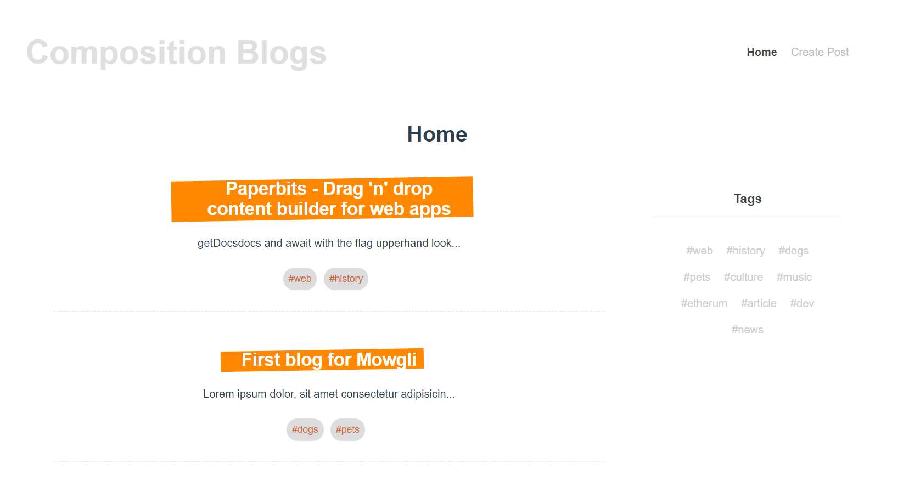

# :sparkles: App-composition-blog 
> a blog apps tied with firebase firestore cloud data base for creating, deleting, viewing blog post

[](https://cli.vuejs.org/)
[](https://firebase.google.com/)
[](https://opensource.org/licenses/MIT)

A very small apps to practice compostiion api tied to realtime database from firebase



# Table of Content <!-- omit in toc -->
- [:sparkles: App-composition-blog](#sparkles-app-composition-blog)
  - [:floppy_disk: Prerequisite](#floppy_disk-prerequisite)
  - [:computer: Usage](#computer-usage)
- [:checkered_flag: Objective cleared](#checkered_flag-objective-cleared)

---
## :floppy_disk: Prerequisite
- [json-server](https://github.com/typicode/json-server)
## :computer: Usage
clone the app directly from the branch.

```bash
$ git clone git@github.com:ArtificialNeuralIntelligence/col-of-vue-apps.git --branch app-composition-blog --single-branch
$ cd <cloned_dir>
$ npm install
$ npm run serve
```

:mega: Tips: If needed reset the branch name to main and add new remote repo ssh

```
git branch -m app-composition-blog main
git remote rm origin
git remote add origin <new_git_repo_ssh_url>
```

---
# :checkered_flag: Objective cleared


| Target                   | Understanding | Used in this app   |
| ------------------------ | ------------- | ------------------ |
| composition api          | 3/5           | :white_check_mark: |
| firebase                 | 2/5           | :white_check_mark: |
| async await              | 4/5           | :white_check_mark: |
| props on setup           | 4/5           | :white_check_mark: |
| router on composition    | 4/5           | :white_check_mark: |
| lifecycle on composition | 4/5           | :white_check_mark: |
| watch and watchEffect    | 3/5           | :white_check_mark: |
